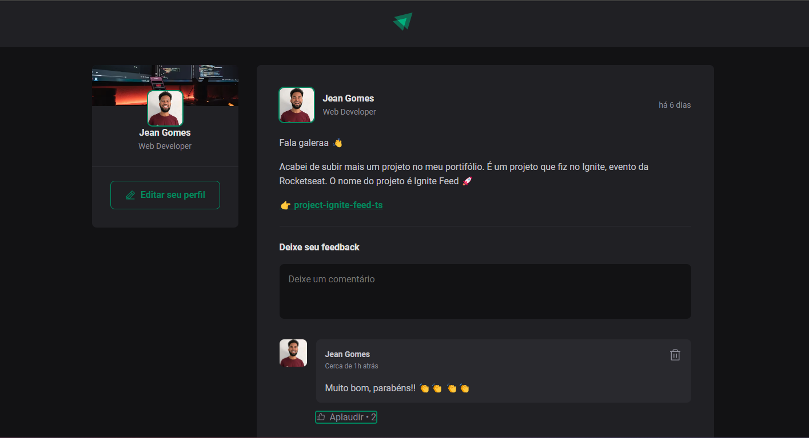

<h1 align="center">Projeto - React e Typescript : Ignite Feed</h1>

<p align="center">
  

  

  
  
  <a href="https://github.com/JeanGomes01/Github-Blog/commits/master">
    
  </a>
    
   <a href="https://github.com/JeanGomes01/project-ignite-feed-ts/stargazers">
    
  </a>
</p>

<p align="center">Vamos construir Projeto de feed social desenvolvido em React e TypeScript, permitindo a postagem, curtidas e comentários e gerenciamento de estado, garantindo uma experiência interativa e responsiva. </p>

<p align="center">

</p>

## 🥶 Sobre o projeto

Desenvolvi esse projeto para reforçar meu conhecimento em React JS com Typescript na criação de telas responsivas e dinâmicas, com componentes, motores do React, validação de formulários, iteração com JSX, extensão de interfaces Typescript, criando, editando e removendo formulários.

## 🚀 Tecnologias

Principais tecnologias que utilizei para desenvolver esta aplicação

- [Typescript](https://www.typescriptlang.org/)
- [React](https://react.dev/blog/2023/03/16/introducing-react-dev/)
- [Phosphor-Icon](https://github.com/phosphor-icons/homepage)
- [date-fns](https://www.npmjs.com/package/date-fns)

## Guia de inicialização

Para instalar e configurar uma cópia local, siga estas etapas simples:

### Pré-requisitos

Para garantir o funcionamento adequado da nossa aplicação, verifique abaixo:

1. **Clone o repositório de terceiros que contém a api pronta para poder testar o app**: Neste link: [API-Terceiros](https://github.com/rocketseat-education/ignite-reactjs-01-fundamentos-react)

2. **Clone o repositório**:

```sh
git clone https://github.com/JeanGomes01/project-ignite-feed-ts
```

3. **Navegue na raiz do projeto appTrainerGym:**

4. **Instale os módulos:**

```sh
npm i
```

5. **Copie o .env de exemplo:**

6. **Rode o aplicativo:**

```sh
npm run dev
```

## Roadmap

- [x] Conseguir fazer comentários

- [x] Conseguir remover comentários

- [x] Conseguir dar curtidas

<!-- --------------------- -->

## UI UX

UI e UX feita pelo time de design do treinamento do curso da rocketseat.

|             Tela de inicial              |     |
| :--------------------------------------: | :-: |
|  |  !  |
